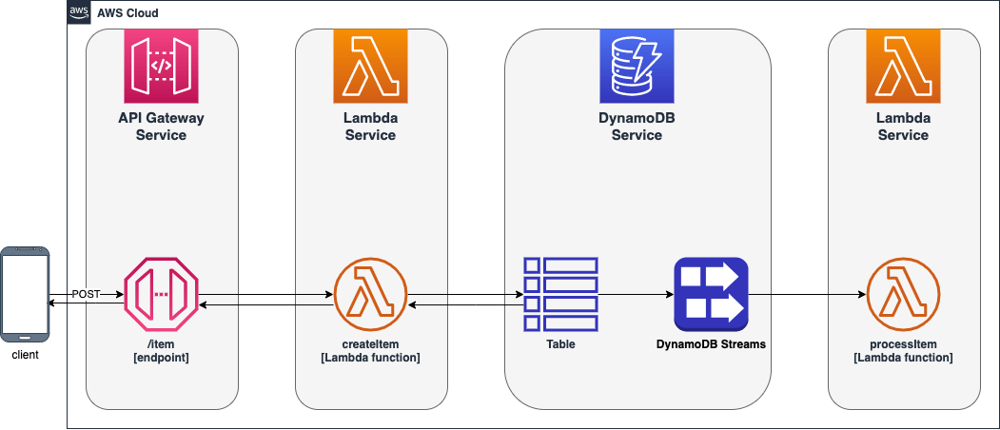
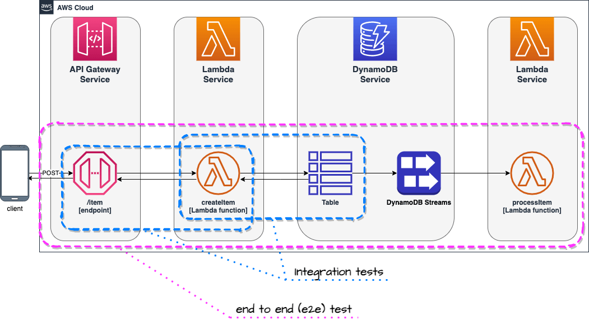
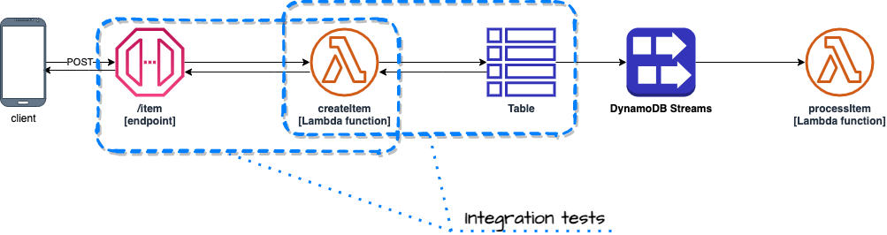
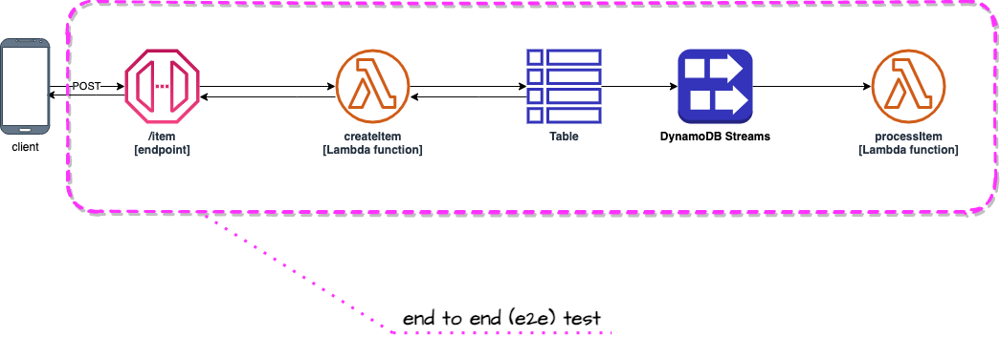

# serverless-hexagonal-template

[](https://github.com/serverlesspolska/serverless-hexagonal-template/blob/main/LICENSE)
[](https://github.com/serverlesspolska/serverless-hexagonal-template/stargazers)
[](http://makeapullrequest.com)


Highly opinionated project template for [Serverless Framework](https://www.serverless.com/) that applies **hexagonal architecture** principles to the serverless world. Crafted with easy testing in mind.

# Recent modernization

At the beginning of 2024 this project has been refurbished. 

Here's a snapshot of significant updates that have been done:
* 𝘿𝙚𝙥𝙚𝙣𝙙𝙚𝙣𝙘𝙮 𝙖𝙣𝙙 𝙍𝙪𝙣𝙩𝙞𝙢𝙚 𝙐𝙥𝙜𝙧𝙖𝙙𝙚: We've successfully transitioned from Node 16 to Node 20, ensuring our project stays at the cutting edge of technology.
* 𝙀𝙢𝙗𝙧𝙖𝙘𝙞𝙣𝙜 𝙈𝙤𝙙𝙚𝙧𝙣 𝙅𝙖𝙫𝙖𝙎𝙘𝙧𝙞𝙥𝙩: By shifting from require statements to import, our code now fully leverages Node modules, streamlining our development process.
* 𝘼𝙒𝙎 𝙎𝘿𝙆 𝙀𝙫𝙤𝙡𝙪𝙩𝙞𝙤𝙣: Our migration from AWS SDK v2 to v3 marks a significant leap forward in efficiency and performance.
* 𝙈𝙞𝙙𝙙𝙡𝙚𝙬𝙖𝙧𝙚 𝙖𝙣𝙙 𝙏𝙚𝙨𝙩𝙞𝙣𝙜 𝙀𝙣𝙝𝙖𝙣𝙘𝙚𝙢𝙚𝙣𝙩𝙨: Updates to Middy v5 middleware and aws-testing-library have fortified our project, eliminating deprecated dependencies and vulnerabilities.
* 𝙊𝙥𝙩𝙞𝙢𝙞𝙯𝙞𝙣𝙜 𝘼𝙋𝙄 𝘾𝙖𝙡𝙡𝙨: Replacing Axios with native fetch has optimized our API interactions and reduced our project's complexity.
* 𝙎𝙩𝙧𝙪𝙘𝙩𝙪𝙧𝙚𝙙 𝙇𝙤𝙜𝙜𝙞𝙣𝙜 𝙬𝙞𝙩𝙝 𝙋𝙤𝙬𝙚𝙧𝙏𝙤𝙤𝙡𝙨: The introduction of the PowerTools logger has transformed our logging process, enabling more effective tracking and analysis.
* 𝙀𝙣𝙝𝙖𝙣𝙘𝙚𝙙 𝙋𝙚𝙧𝙛𝙤𝙧𝙢𝙖𝙣𝙘𝙚 with AJV Pre-compilation: By introducing AJV pre-compilation of schemas for Middy Validator, we've dramatically 𝗿𝗲𝗱𝘂𝗰𝗲𝗱 𝗼𝘂𝗿 𝗹𝗮𝗺𝗯𝗱𝗮 𝗽𝗮𝗰𝗸𝗮𝗴𝗲 𝘀𝗶𝘇𝗲 𝗳𝗿𝗼𝗺 𝟭.𝟳𝗠𝗕 𝘁𝗼 𝟰𝟳𝟴𝗞𝗕 (𝟳𝟮%). This significant reduction lowers cold start times and boosts overall performance.
* 𝙎𝙞𝙢𝙥𝙡𝙞𝙛𝙞𝙘𝙖𝙩𝙞𝙤𝙣 𝙤𝙛 𝙘𝙧𝙚𝙙𝙚𝙣𝙩𝙞𝙖𝙡 𝙢𝙖𝙣𝙖𝙜𝙚𝙢𝙚𝙣𝙩: AWS CLI profile was removed from the configuration file due to complications it introduced in CI/CD configurations.

# Quick start

This is a *template* from which you can create your own project by executing following command:
```
sls create --template-url https://github.com/serverlesspolska/serverless-hexagonal-template/tree/main --name your-project-name
```

Next install dependencies:
```
cd your-project-name
npm i
```
and deploy to your `dev` stage in default region:
```
sls deploy
```
# High-level architecture
This template implements depicted below architecture. The application itself is just an example used to show you how to test serverless architectures. 

You can easily modify the source code and tailor it to your needs.

# Why use this template?
This template project was created with two goals in mind: ***streamlined developer's flow*** and ***easy testing***, because, sadly, both are not common in serverless development yet. 

## Standardized structure
The project structure has been worked out as a result of years of development in Lambda environment using Serverless Framework. It also takes from the collective experience of the community (to whom I am grateful) embodied in books, talks, videos and articles.

This template aims to deliver ***common structure*** that would speed up development by providing sensible defaults for boilerplate configurations. It defines *where what* should be placed (i.e. source code in `src/` folder, tests in `__tests__` etc.) so you don't need to waste time on thinking about it every time you start new project and creates common language for your team members. Thus, decreasing *cognitive overload* when switching between projects started from this template.

### Structure explanation
There are some guidelines in terms of folders structure and naming conventions.

|Path|Description|Reason|
|-|-|-|
|`./__tests__`|default folder name for tests when using `jest`. Substructure of this folder follows ***exactly*** the `./src/` structure.|Don't keep tests together with implementation. Easier to exclude during deployment. Easier to distinguish between code and implementation.|
|`./config`|all additional config files for `jest` and deployment|`deployment.yml` is included in `serverless.yml`, it is separate because when you have multiple microservices making single system they should share same *stages* and *regions*. Also you can put VPC configuration there.|
|`./documentation`|You may keep here any documentation about the project.||
|`./src`|Implementation code goes here|This is a widespread convention.|
|`./src/<functionName>/`|Each Lambda function has it's own folder|Better organization of the code.|
|`./src/<functionName>/function.js`|Every file that implements Lambda's `handler` method is named `function.js`. The handler method name is always `handler`|Easy to find Lambda handlers.|
|`./src/common/`|Place where common elements of implementation are stored. Most implementation code goes here. You should follow [Single-responsibility principle](https://en.wikipedia.org/wiki/Single-responsibility_principle).|**Makes testing possible and really easy**!|
|`./src/common/adapters/<name>Adapter.js`|For files implementing *technical* part of an Adapter in terms of Hexagonal Architecture|This should be very generic i.e. class that allows connections to MySQL **without** any particular SQL code that you want to execute in your usecase.|
|`./src/common/entities/<EntityName>.js`|Here you keep files that represent objects stored in your *repository* (database)|Useful when you use database 😉|
|`./src/common/services/<name>Service.js`|For files implementing *business* part of an Adapter in terms of Hexagonal Architecture|This service uses corresponding `<name>Adapter.js` adapter or adapters. You would put a specific SQL code here and pass it to adapter instance to execute it.|

After working a lot with that structure I ***saw a pattern emerging*** that `<name>Adapter.js` together with `<name>Service.js` they both implement an adapter in terms of Hexagonal Architecture. Moreover, usually well written adapters (`<name>Adapter.js`) can be reused among different projects (can be put into separate NPM package).

### File naming conventions
If a file contains a `class` it should be named starting with big letter i.e `StorageService.js`. If file does not contain a class but one or many JavaScript functions name start from small letter i.e `s3Adapter.js`.

## Hexagonal architecture
Design of the code has been planned with hexagonal architecture in mind. It allows better separation of concerns and makes it easier to write code that follows single responsibility principle. Those are crucial characteristics that create architectures which are easy to maintain, extend and test.

## Easy testing
Tests are written using `jest` framework and are divided into three separate groups:
* unit
* integration
* end to end (e2e)


Note: Unit tests not shown on the diagram for clarity.
### Unit tests
Those tests are executed locally (on developers computer or CI/CD server) and don't require access to any resources in the AWS cloud or on the Internet.

Unit tests are ideal to test your *business logic*. You may also decide to test your *services* (located at `src/common/services`). Both are really easy to do when using **hexagonal architecture**.

Please **don't** mock whole AWS cloud in order to test everything locally. This is wrong path. Just don't do that. 😉

```
npm run test
```

### Integration tests

Integration tests focus on pieces of your code (in OOP I'd say *classes*), that realize particular *low* & *mid* level actions. For example your Lambda function may read from DynamoDB, so you would write a *service* and *adapter* modules (classes) that would implement this functionality. Integration test would be executed against **real** DynamoDB table provisioned during deployment of that project. However the code will be running locally (on you computer or CI/CD server).



Those tests require resources in the cloud. In order to execute them you first need to *deploy* this project to AWS. 
```
sls deploy
npm run integration
```
Those commands deploy project to the cloud on `dev` stage and execute integration tests.

The `npm run integration` command executes underneath the `serverless-export-env` plugin that exports environment variables set for each Lambda function in the cloud. Results of that command are saved locally to the `.awsenv` file. This file is later injected into `jest` context during tests.

There is also a *shortcut* command that executes tests but doesn't execute `serverless-export-env` plugin. It requires the `.awsenv` file to be already present. Since environment variables don't change that often this can save you time.
```
npm run int
```

### End to end tests (e2e)
End to end tests focus on whole use cases (from beginning to the end) or larger fragments of those. Usually those tests take longer than integration tests. 

An example of such test would be `POST` request sent to API Gateway `/item` endpoint and a check if `processItem` Lambda function was triggered by DynamoDB Streams as a result of saving new item by `createItem` Lambda function invoked by the request. Such approach tests *chain of events* that happen in the cloud and **gives confidence** that integration between multiple services is well configured.



This test is implemented in `__tests__/processItem/functionIsTriggeredByDdbStream.e2e.js`

You can test it yourself by executing:
```
npm run e2e
```

#### Run all tests
Convenience command has been added for running all test. Please bare in mind it requires deployed service.
```
npm run all
```
**Note**: 
> Tests will be executed against your individual development environment - [see section below](#deployment). If you want to execute all test on `dev` stage, please execute `npm run all-dev` command.

#### DEBUG mode
If you want to see logs when running tests on your local machines just set environment variable `DEBUG` to value `ON`. For example:
```
DEBUG=ON npm run test
 # or
DEBUG=ON npm run integration
```

#### GUI / acceptance tests
End to end tests are not a substitution to GUI or acceptance tests. For those other solutions (such as AWS CloudWatch Synthetics) are needed.

## Deployment
### Isolated per developer stages (multiple development environments)
Many users asked me to add a **feature allowing developers to work in parallel on isolated stages**. Common *best practice* says that each developer should use a separate AWS account for development to avoid conflicts. Unfortunately, for many teams and companies, managing multiple AWS accounts poses a challenge of its own.

In order to remove that obstacle, I decided to implement a simple solution that would allow many developers to use a single AWS account for development. **Remember, your production stage should be deployed on a different AWS account for security and performance reasons!**

When executing the `serverless` or `sls` command without the` -s` (stage) parameter, your `username` will be used to name the stage. 

> For example, my user name on my laptop is `pawel` therefore, the stage will be named `serverless-hexagonal-template-dev-pawel`. Settings such as deployment `region` will be inherited from the dev configuration.

In that way, your colleagues can deploy their own stages (development environments) in the same region on the same AWS account without any conflicts (given that their usernames are unique in the scope of your project).

To use that feature, simply execute command without providing any stage name:
```
sls deploy
```

### Regular deployment
Deployment to `dev` stage.
```
sls deploy -s dev
```
Deployment to a specific stage
```
sls deploy -s <stage> # stage = dev | test | prod
```

The stages configuration is defined in `config/deployment.yml` file.

### Deployment credentials

#### Changes to AWS CLI `profile` configuration
In the previous version of this template, the AWS CLI `profile` was specified in the Serverless Framework configuration file (`config/deployment.yml`) and utilized during the deployment process. This approach has been phased out due to complications it introduced in CI/CD configurations.

The template now adheres to the standard AWS and Serverless Framework credentials resolution method as outlined in the [AWS documentation](https://docs.aws.amazon.com/sdkref/latest/guide/standardized-credentials.html).

#### Credentials Resolution Order
The system will attempt to resolve your credentials in the following order:
1. Environment variables `AWS_ACCESS_KEY_ID` and `AWS_SECRET_ACCESS_KEY` are checked first.
1. If not found, the `default` AWS `profile` is used.
1. Other / custom method.

#### Custom profile configuration
For those requiring a different `profile` than the `default`, it is recommended to use the `direnv` tool. This allows you to specify an AWS profile for your project within the `.envrc` file located at the project root directory, overriding system settings. Ensure that the AWS profile is already defined in your `~/.aws/credentials` file or `~/.aws/config` if you use SSO.

To set up `direnv`, follow these steps:

1. Define your AWS profile in the `.envrc` file to automatically use it within the project's directory and its subdirectories.
```Bash
# Set a default profile for this directory
export AWS_PROFILE=my-dev-profile
```
2. Alternatively, you can directly set your access keys:
```Bash
# Set AWS access keys directly
export AWS_ACCESS_KEY_ID=<access_key_value>
export AWS_SECRET_ACCESS_KEY=<secret_access_key_value>
```
**Note**: These credentials are utilized not only during the deployment process but also for integration and end-to-end testing.

For more information on direnv and its setup, visit https://direnv.net.

# What's included?

Serverless Framework plugins:
- [serverless-iam-roles-per-function](https://github.com/functionalone/serverless-iam-roles-per-function) - to manage individual IAM roles for each function
- [serverless-export-env](https://github.com/arabold/serverless-export-env) - to export Lambda functions environment variables in `.awsenv` file


Node.js development libraries:

* AWS SDK
* Eslint with modified airbnb-base see `.eslintrc.yml`
* Jest
* dotenv
* [aws-testing-library](https://github.com/erezrokah/aws-testing-library) for *end to end* testing
* [serverless-logger](https://github.com/serverlesspolska/serverless-logger)
